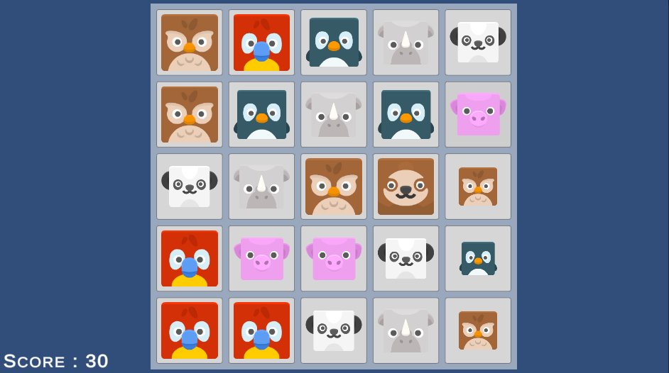

# Match3Animal Game Project
AnimalSwap is a delightful match-3 puzzle game featuring adorable animal faces. Players can swap adjacent animal faces to create matches of three or more identical animals, scoring points and triggering chain reactions for higher scores.

## Controls
- Input: The game is controlled entirely using the left mouse click.
- Interaction: Players click on an animal face to select it and then click on an adjacent animal face to swap positions.

## Screen Indicators
- Score Text : When Players gain point, points will be written on the Score Text Object

## Controls

- **Input:** The game is controlled entirely using the left mouse click.
- **Interaction:** Players click on an animal face to select it and then click on an another animal face to swap positions.

## Gameplay

### Objective

The primary goal of AnimalSwap is to achieve the highest possible score by strategically swapping animal faces and creating chain reactions.

### Core Mechanics

1. **Animal Swapping:**
   - Click on an animal face to select it.
   - Click on an another animal face to swap positions.

2. **Matching:**
   - If the swapped animal faces form a horizontal or vertical line of at least three identical animals, they will disappear.
   - Points are awarded based on the number of animal faces in the match.

3. **Chain Reactions:**
   - New matches may create chain reactions, leading to additional matches and higher scores.

4. **Filling Blank Spaces:**
   - After animal faces disappear, the empty spaces are filled by new animal faces.

## ScreenShot

